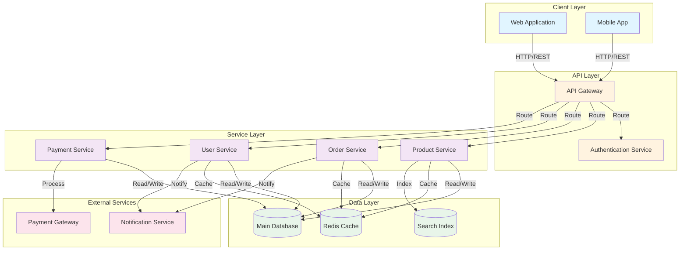

# Shopee Architecture Overview

## System Architecture Diagram

## Architecture Components

### Client Layer
- **Web Application**: Browser-based shopping interface
- **Mobile App**: Native or cross-platform mobile client

### API Layer
- **API Gateway**: Central entry point for all client requests
- **Authentication Service**: Manages user authentication and authorization

### Service Layer
- **Product Service**: Manages product catalog and inventory
- **Order Service**: Handles order creation and management
- **User Service**: Manages user profiles and preferences
- **Payment Service**: Processes payment transactions

### Data Layer
- **Main Database**: Primary data store for all services
- **Redis Cache**: In-memory caching for frequently accessed data
- **Search Index**: Elasticsearch or similar for product search

### External Services
- **Payment Gateway**: Third-party payment processing
- **Notification Service**: Email and push notifications

## Data Flow

1. Clients send requests through the API Gateway
2. Gateway routes requests to appropriate services
3. Services process requests and interact with databases
4. Cache layer reduces database load
5. External services handle specialized operations
6. Responses flow back through the gateway to clients